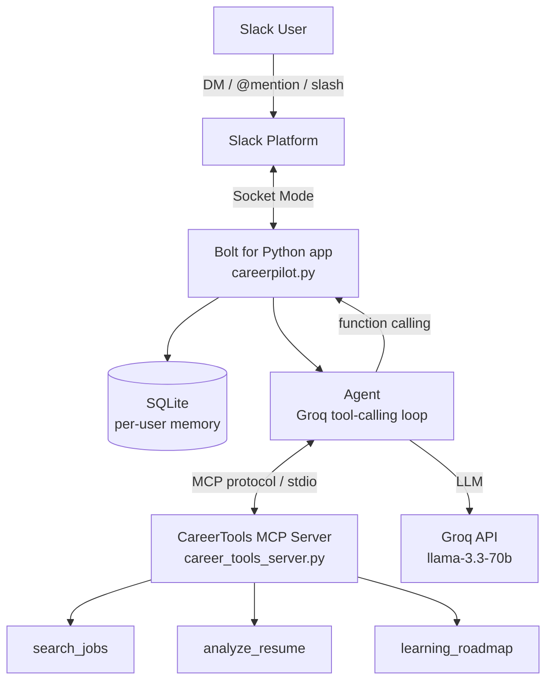

# CareerPilot — AI Career Teammate for Slack

> Built for the **Slack Agent Builder Challenge** (New Slack Agent track).

CareerPilot is an AI teammate that lives inside Slack and helps students and
early-career engineers with **career roadmaps, internships, resume/LinkedIn
tips, and research summaries** — with **persistent per-user memory** and real
**tools served over the Model Context Protocol (MCP)**.

Ask it a question in a DM, a channel `@mention`, or via slash commands. It
remembers your conversation and calls specialized tools (job search, resume
keyword analysis, learning roadmaps) whenever they help.

---

## Why CareerPilot

Career guidance is fragmented across job boards, resume checkers, and random
blog posts — and none of it lives where teams already work. CareerPilot brings
an agentic career advisor **into Slack**, so a cohort, bootcamp, or student
community can get grounded, tool-backed help without leaving their workspace.

- **Not just a chatbot** — it uses real tools via an MCP server and remembers
  each user across turns.
- **Meets people where they are** — Slack DMs, channels, and slash commands.
- **Grounded answers** — job links, keyword-gap scores, and structured
  roadmaps come from tools, reducing hallucination.

---

## Features

| Feature | Description |
|---------|-------------|
| **Slash commands** | `/career`, `/research`, `/resume`, `/forget`, `/help` |
| **DM mode** | Message the bot directly — natural language, no slash needed |
| **@mention** | Mention CareerPilot in any channel; it replies in-thread |
| **Per-user memory** | SQLite-backed history isolated per Slack user |
| **MCP tools** | `search_jobs`, `analyze_resume`, `learning_roadmap` |
| **Tool transparency** | Each reply shows which MCP tools were used |
| **Resilient** | Auto-reconnect supervisor survives network drops |

---

## Architecture



**Flow:** a Slack event reaches the Bolt app over Socket Mode → the agent loads
the user's memory → Groq decides whether to call an MCP tool → tools run in the
CareerTools MCP server over stdio → the agent synthesizes a final answer →
CareerPilot replies and saves the exchange.

---

## Tech Stack

- **Slack:** Bolt for Python, Socket Mode, slash commands, Block Kit, App Home
- **MCP:** `mcp` Python SDK (FastMCP server + stdio client)
- **LLM:** Groq (`llama-3.3-70b-versatile`) with function calling
- **Memory:** SQLite (per-user isolation)
- **Language:** Python 3.11+

---

## Project Structure

```
careerpilot-slack-agent/
├── slack_app/
│   ├── careerpilot.py      # Bolt entry point: handlers + supervisor loop
│   ├── agent.py            # Groq tool-calling loop + memory integration
│   ├── mcp_client.py       # Sync wrapper over async MCP stdio client
│   ├── memory_store.py     # SQLite per-user memory
│   ├── manifest.json       # Slack app manifest
│   ├── requirements.txt
│   └── .env.example
├── mcp_server/
│   └── career_tools_server.py  # CareerTools MCP server (3 tools)
└── README.md
```

---

## Setup

### 1. Prerequisites

- Python 3.11+
- A Slack workspace where you can install apps
- A free [Groq API key](https://console.groq.com/keys)

### 2. Create the Slack app

1. Go to [api.slack.com/apps/new](https://api.slack.com/apps/new) → **From an app manifest**
2. Select your workspace and paste `slack_app/manifest.json`
3. **Install to Workspace** → **Allow**
4. **Basic Information → App-Level Tokens** → generate a token with the
   `connections:write` scope → copy the `xapp-` token
5. **OAuth & Permissions** → copy the **Bot User OAuth Token** (`xoxb-`)

### 3. Configure environment

```bash
cd slack_app
cp .env.example .env      # Windows: copy .env.example .env
```

Fill in `.env`:

```
SLACK_BOT_TOKEN=xoxb-...
SLACK_APP_TOKEN=xapp-...
GROQ_API_KEY=gsk_...
```

### 4. Install & run

```bash
cd slack_app
python -m venv .venv
.venv\Scripts\Activate.ps1      # macOS/Linux: source .venv/bin/activate
pip install -r requirements.txt
python -u careerpilot.py
```

You should see:

```
Starting CareerTools MCP server...
MCP ready — 3 tools: search_jobs, analyze_resume, learning_roadmap
CareerPilot is running (Socket Mode).
Bolt app is running!
```

---

## Usage

| Command | Example |
|---------|---------|
| `/career` | `/career Find backend internships in Islamabad` |
| `/research` | `/research Explain RAG in simple terms` |
| `/resume` | `/resume Built a FastAPI app with Docker and Postgres` |
| `/forget` | clears your conversation memory |
| `/help` | shows all commands |
| **DM** | just message the bot in a DM — it remembers context |
| **@mention** | `@CareerPilot how do I prep for interviews?` |

---

## MCP Tools

The **CareerTools MCP server** exposes three tools the agent can call:

- **`search_jobs(role, location, seniority)`** — builds targeted job-search
  links (LinkedIn, Indeed, Wellfound, Google Jobs) plus role keywords.
- **`analyze_resume(resume_text, target_role)`** — scores a resume against a
  role's expected keywords and lists gaps + fixes.
- **`learning_roadmap(skill, level)`** — returns a structured, step-by-step
  roadmap for a skill (python, react, rag, llm, docker, …).

Because the tools speak MCP over stdio, the server can be reused by any
MCP-compatible client, not just CareerPilot.

---

## License

MIT
